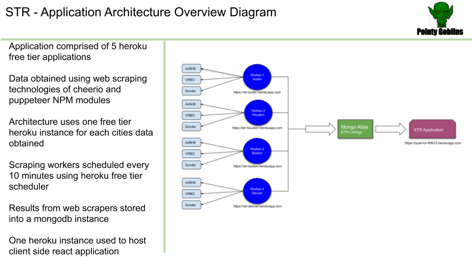
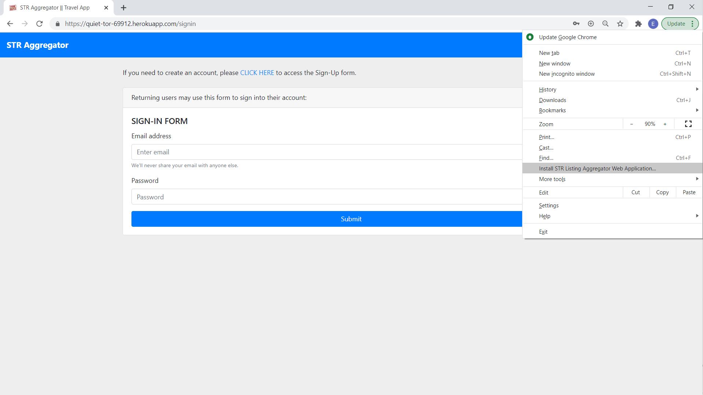
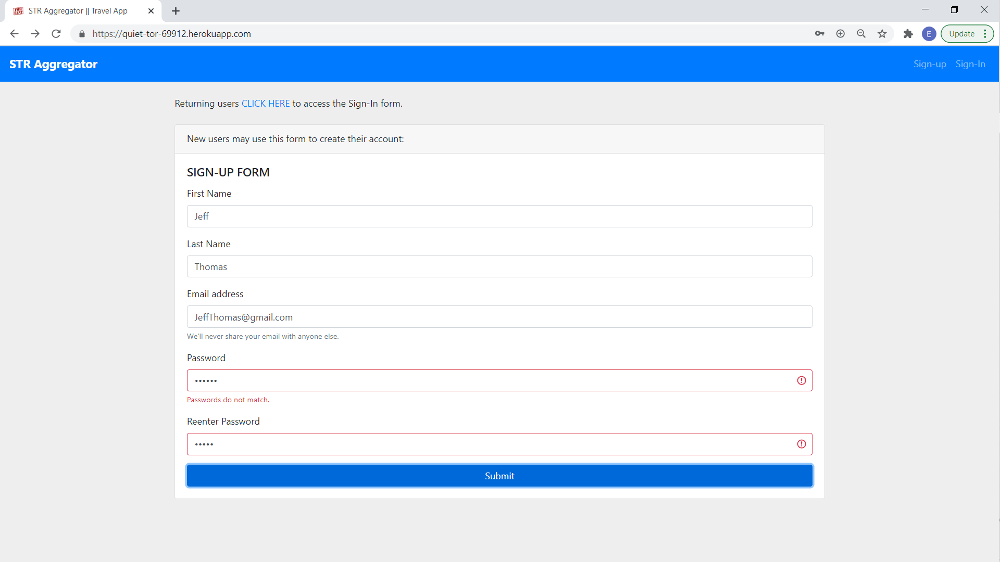
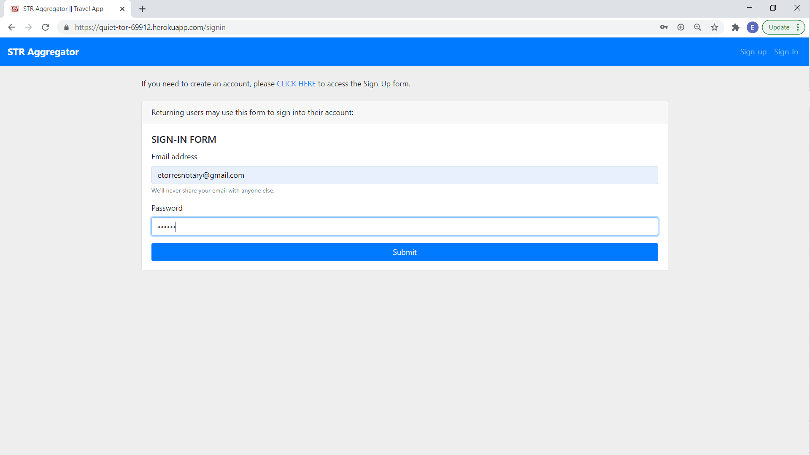
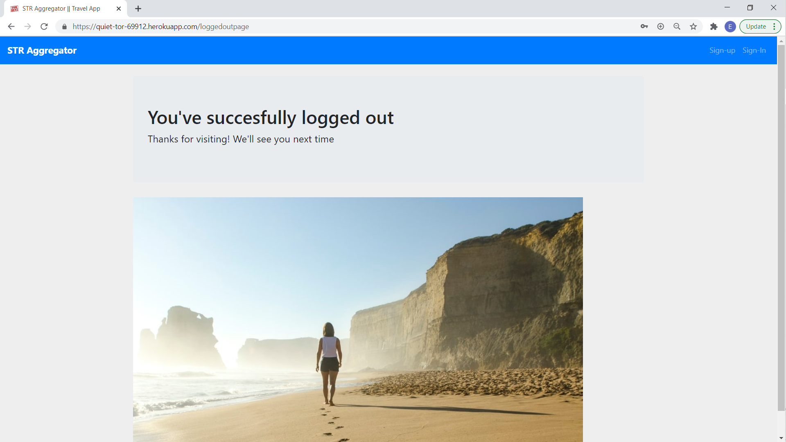
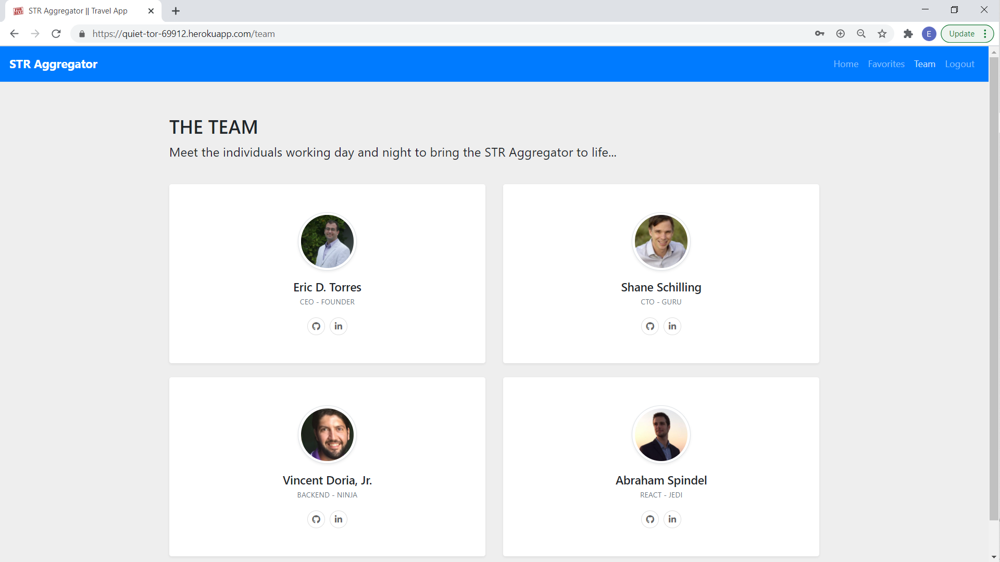

# STR Aggregator

## Project Description

The [STR Aggregator](https://quiet-tor-69912.herokuapp.com/) is a MERN full-stack web application that utilizes web scrappers to collect information; [**MongoDB**](https://www.mongodb.com/) for the backend; [**Express.js**](https://expressjs.com/) for server routing; [**React.js**](https://reactjs.org/) for client-side routing and views;and, [**Node.js**](https://nodejs.org/en/) for its runtime environment.

## Table of Contents

- [Title](#project-title)
- [Description](#project-description)
- [Table of Contents](#table-of-contents)
- [Installation](#installation-instructions)
- [Usage](#usage)
- [Contributing](#guidelines-for-contributing)
- [Tests](#tests)
- [Technologies](#technologies-used)
- [Collaborators](#collaborators)
- [Questions](#questions)
- [License](#license)

## Installation Instructions

Users may clone the [STR Aggregator Repo](https://github.com/etorres-revature/Pointy_Goblins). Or, use the app as deployed on Heroku: [STR Aggregator](https://quiet-tor-69912.herokuapp.com/).

## Usage

The [STR Aggregator](https://quiet-tor-69912.herokuapp.com/) is deployed on Heroku.

The [STR Aggregator](https://quiet-tor-69912.herokuapp.com/) is comprised of 5 heroku apps. Behind the scenes there are four web scrapers being utilized to scrape STR listings from AirBnB, VRBO, and Sonder.com. The [Web Scraper Repo](https://github.com/trilambda122/STR-webworkers) is being used for those apps and they are set to fire off every ten minutes. The listings collected by the web scrapers are saved into the MongoDB database collection specific for that city, and displayed in the STR Aggregator when the user chooses that particular city. Below is a diagram of the process.

 

PROGRESSIVE WEB APPLICATION (PWA):  The [STR Aggregator](https://quiet-tor-69912.herokuapp.com/) leverages the built in React.js capabilities to provide a Manifest and Service Worker enabling use as a PWA.

Users begin by being presented with the Sign-up page where they will be prompted to enter their First Name, Last Name, E-mail Address, and Password. Passwords are entered twice and have validation to ensure they are the same.

Returning users can go directly to the Sign-in page where they will be prompted to enter their E-mail Address and Password.

Once authenticated a user will be brought to the Landing Page. Here the User is presented with the options for one of four cities to search for Short-term Rental listings.

When the User chooses a city to search, the [STR Aggregator](https://quiet-tor-69912.herokuapp.com/) goes to the MongoDB Collection of that city and gets that most recent web scrapings to show to the User.

Each listing contains: a photo of the STR, the STR title, STR details, the price of the STR, a link to the STR listing on the site from which it was scraped, and a button that will add that listing to a list of user favorites.

After the User is finished planning their trip they can log out. 

This is the team that brought you the [STR Aggregator](https://quiet-tor-69912.herokuapp.com/).

## Guidelines for Contributing

Please e-mail one of the contributors at their address listed below with any thoughts on future updates or feature suggestions.

## Tests

Test early; test often.

### Technologies Used

### :computer: :computer: :computer: :computer: :computer: :computer:

#### :memo: HTML5 :memo:

**HTML5** is a markup language used for structuring and presenting content on the World Wide Web. The goals are to improve the language with support for the latest multi-media and other new features; to keep the language both easily readable by humans and consistently understood by computers and devices; and to remain backward compatible to older software. Many new symantec features are included.

_HTML5_ content borrowed from <a target="_blank" rel="noopener noreferrer">[this page](https://en.wikipedia.org/wiki/HTML5).</a>

#### :art: CSS :art:

**Cascading Style Sheets (CSS)** is a stylesheet language used for describing the presentation of a document written in a markup language (such as HTML5). CSS is designed to enable the separation of presentation and content; including layout, colors, and fonts. This separation improves content accessibility to provide more flexibility and control in the specification of presentation characteristics, enabling multiple web pages to share formatting by specifying relevant CSS in a separate file, which reduces complexity and repetition in the structural content (HTML), as well as enabling the file to be cached to improve the page load speed between the pages that share the file and its formatting.

Separation of formatting and content also makes it feasible to present the same markup page in different styles for different rendering methods, such as on-screen, in print, by voice, and on Braille-based tactile devices.

_CSS_ content borrowed from <a target="_blank" rel="noopener noreferrer">[this page](https://en.wikipedia.org/wiki/Cascading_Style_Sheets).</a>

#### :shoe: Bootstrap 4 :shoe:

**Bootstrap 4** is a free and open-source CSS framework directed at responsive, mobile-first front-end web development. It contains CSS and (optionally) JavaScript-based design templates for typography, forms, buttons, navigation, and other interface components.

_Bootstrap 4_ content borrowed from <a target="_blank" rel="noopener noreferrer">[this page](https://en.wikipedia.org/wiki/Bootstrap\_(front-end_framework)).</a>

#### :sparkler: JavaScript :sparkler:

**JavaScript (JS)** is one of the core technologies of the World Wide Web (along with HTML and CSS). It enables interactive web pages and is an essential part of web applications. JS is a multi-faceted, scripting language that provides versatility through Application Programming Interfaces (APIs) and Document Object Model (DOM) manipulation, among others.

_JavaScript_ content borrowed from <a target="_blank" rel="noopener noreferrer">[this page](https://en.wikipedia.org/wiki/JavaScript).</a>

#### :globe_with_meridians: NODE.js :globe_with_meridians:

**NODE.js** is an open-source, cross-platform JavaScript runtime environment that execute JavaScript code outside a web browser. NODE.js lets developers use JavaScript to write command line tools and for server-side scripting. NODE.js represents a "Javascript everywhere" paradigm, unifying web-application development around a single programming language, rather than different programming languages for server- and client-side scripts.

_NODE.js_ content borrowed from <a target="_blank" rel="noopener noreferrer">[this page](https://en.wikipedia.org/wiki/Node.js).</a>

[Download Node.js](https://nodejs.org/en/).

#### :satellite: Express.js :satellite:

**Express.js** is a minimal and flexible NODE.js web application framework that provides a robust set of features for web and mobile applications. The myriad HTTP utility methods and middleware allow for the creation of a robust API. Express.js provides a thin layer of fundamental features, without obscuring NODE.js features.

_Express.js_ content borrowed from <a target="_blank" rel="noopener noreferrer">[this page](https://expressjs.com/).</a>

#### :japanese_ogre: MongoDB :japanese_ogre:

**MongoDB** is a document-oriented NoSQL database used for high volume data storage. Instead of using tables and rows like traditional databases, MongoDB makes use of collections and documents. Documents consist of key-value pairs that are the basic unit of data and more closely resemble the JSON architecture.

_MongoDB_ content borrowed from <a target="_blank" rel="noopener noreferrer">[this page](https://www.guru99.com/what-is-mongodb.html#:~:text=MongoDB%20is%20a%20document%2Doriented,use%20of%20collections%20and%20documents.&text=Collections%20contain%20sets%20of%20documents,equivalent%20of%20relational%20database%20tables).</a>

#### :dizzy: React.js :dizzy:

**React.js** is an open source JavaScript library that is used for building interfaces for single-page applications, which handles the view layer for web and mobile apps. React allows for the creation of reusable UI components. This allows developers to create large web applications that change data, without reloading the page.

_React.js_ content borrowed from <a target="_blank" rel="noopener noreferrer">[this page](https://www.c-sharpcorner.com/article/what-and-why-reactjs/#:~:text=It's%20used%20for%20handling%20the,to%20create%20reusable%20UI%20components.&text=React%20allows%20developers%20to%20create,fast%2C%20scalable%2C%20and%20simple.).</a>

### Collaborators

This _STR Aggregator_ was conceived, created, and coded by the following group of collaborators:

|                  _TEAM_                  |                 _Members_                  |
| :--------------------------------------: | :----------------------------------------: |
| :football: Vincent Doria, Jr. :football: |      :beers: Shane Schilling :beers:       |
|     :8ball: Abraham Spindel :8ball:      | :green_heart: Eric D. Torres :green_heart: |

## Questions

Check out our Github profiles:

- [Vincent Doria, Jr.](https://github.com/Cenzo-cmd);
- [Shane Schilling](https://github.com/trilambda122);
- [Abraham Spindel](https://github.com/abraspin);
- [Eric D. Torres](https://github.com/etorres-revature).

You can contact any one of use by e-mail the following:

- Vincent Doria, Jr. - vrdphone@gmail.com
- Shane Schilling - trilambda122@gmail.com
- Abraham Spindel - AbrahamSpindel@gmail.com
- Eric D. Torres - etorresntoary@gmail.com

for any additional questions and/ or clarifications you may need about the project.

##### License

[This application uses the **GNU Affero General Public v3.0 License** found here](./LICENSE).

**[This README.md file generated with my NODE.js README Generator app.](https://github.com/etorres-revature/NODEjs_README.md_Generator)**
